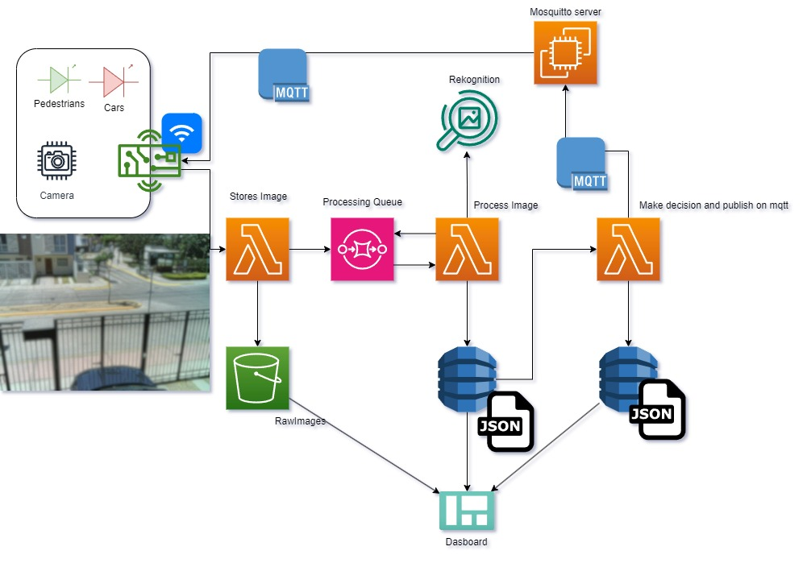

# 🚦 Smart IoT Traffic Light System

An IoT-based smart traffic light prototype using an ESP32 with camera and AWS services to detect and prioritize pedestrians and cars in real-time.

---

## 📸 Overview

This system uses a **camera-equipped ESP32** to monitor a street intersection. Captured images are sent to AWS, where they are processed using **Lambda functions**, **Rekognition**, and stored in **S3/DynamoDB**. Based on object detection (pedestrians vs cars), the system **decides traffic light behavior** and sends control signals via **MQTT**.

---

## 🧠 Key Features

- ESP32-CAM captures live street images
- AWS Lambda stores, queues, and processes images
- Amazon Rekognition identifies people and cars
- Decisions made in the cloud and published via MQTT
- Images and detection data logged in S3/DynamoDB
- Dashboard-ready JSON output for visualization

---

## 🖼️ System Architecture

---

## 🔌 Technologies Used

### Hardware
- ESP32-CAM (OV2640)

### Cloud / Backend
- AWS Lambda
- Amazon S3
- Amazon Rekognition
- DynamoDB
- AWS SQS (Queue)
- MQTT (via Mosquitto server)

### Languages
- Arduino C++
- Python (Lambda functions)

---

## 🧪 How It Works

1. **ESP32-CAM** captures an image when motion is detected.
2. Image is sent to AWS via MQTT and stored in **S3**.
3. An SQS queue triggers **Lambda** to analyze the image using **Rekognition**.
4. Object labels (e.g., "Car", "Person") are saved to **DynamoDB**.
5. Another Lambda function makes a decision (e.g., give priority to pedestrian) and publishes via MQTT.
6. Output data is available as JSON for dashboards.

---

## 📁 Code Structure

- `iot_code.ino` – ESP32 code (camera + MQTT)
- `lambda_store_image.py` – Stores image in S3
- `lambda_process_image.py` – Calls Rekognition and stores labels
- `lambda_make_decision_and_send_mesage.py` – Makes decision and sends MQTT message

---

*This project was developed as part of a university IoT course at ITESO.*
